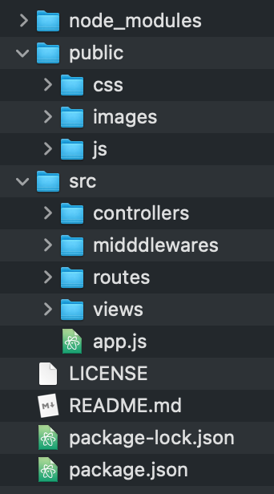
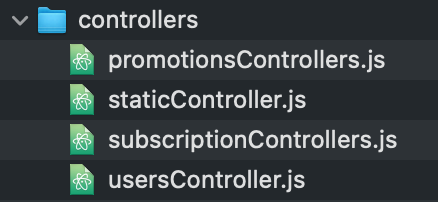
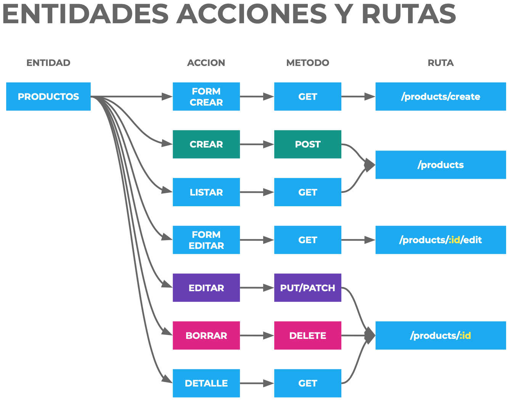

# Workflow to create backend with NodeJS

##### Create Folder structure for a Node.js project.



##### Create README.md, LICENCE & .gitignore.

##### Install Express.

##### Install thrid-party dependencies.

- dotenv.
- cors
  Llevar todo esto a su lugar correspondiente: `app.use(cors());` in app.js file.

> If a social login is required, install passport.

- passport.
  > Documentation: http://www.passportjs.org/
  > Llevar todo esto a su lugar correspondiente: `ver que poner acá` in enDonde.js file.

> If you need to manage the sessions, e.g. Superadmin

- express-session
  Llevar todo esto a su lugar correspondiente: `ver que poner acá` in enDonde.js file.
- cookie-parser
  Llevar todo esto a su lugar correspondiente: `ver que poner acá` in enDonde.js file.

##### Definition of MVC entities.

- Subscriptions.
- Promotions.
- Users.

##### MVC: Create Routes

> Documentation: https://expressjs.com/es/guide/routing.html

In main file. e.g.: <u>app.js</u>

```js
app.get('/', function (request, response) {
  response.send('The Server page works ok');
});

app.get('/subscriptions', function (request, response) {
  response.send('The Subscriptions page works ok');
});

app.get('/promotions', function (request, response) {
  response.send('The Promotions page works ok');
});

app.get('/users', function (request, response) {
  response.send('The Users page works ok');
});

// 404 Not Found
app.get('*', function (request, response) {
  response.send('404 - Not found');
});
```

<u>Test some routes:</u>

· http://localhost:5000/
· http://localhost:5000/subscriptions
· http://localhost:5000/users
· http://localhost:5000/sdfg

##### MVC: Modularize and create routes files (entities).

> A ROUTER is an "entity". BREAD: Browse, Read, Edit, Add, Delete.
> If preparing the backend to consume as API with the frontend, static is not defined as entity.


In main file. e.g.: <u>app.js</u>

```js
const staticRouter = require('./src/routes/staticRouter');
app.use('/', staticRouter);

const subscriptionsRouter = require('./src/routes/subscriptionsRouter');
app.use('/subscriptions', subscriptionsRouter);

const promotionsRouter = require('./routes/promotionsRouter');
app.use('/promotions', promotionsRouter);

const usersRouter = require('./src/routes/usersRouter');
app.use('/users', usersRouter);

// 404 Not Found
app.get('*', function (request, response) {
  response.send('404 - Not found');
});
```

In the router file. e.g.:<u>subscriptionsRouter.js</u>

> Idem in the other routers entities. e.i.: staticRouter.js, promotionsRouter.js, usersRouter.js

```js
const express = require('express');
const router = express.Router();

// Routing to http://localhost:5000/subscriptions
router.get('/', function (request, response) {
  response.send('The Subscriptions page works ok');
});

module.exports = router;
```

##### dotenv: Create the environment variables

> (dotenv documentation)[https://www.npmjs.com/package/dotenv]

In main file. e.i.: <u>app.js</u> `require('dotenv').config();`

Create the environment variables file and its documentation file in the root directory.

In environment variables file. e.i.: <u>.env</u>

```
DB_HOST = localhost
DB_NAME = Juan Pablo
DB_USER = root
DB_PASS = root
DB_PORT = 5000
```

Keep record the documentation of environment variables. e.i.: <u>.env.example</u>

Specify express.js to listen for the port of host variables.

In main file. e.i.: <u>app.js</u>

```js
const port = process.env.DB_PORT;
const host = process.env.DB_HOST;
app.listen(port, () => console.log(`Server on http://${host}:${port}/`));
```

## Acá todavía falta reemplzar las variables de usuarios, seguro que tengo que llevar todo este punto más adelante.

##### MVC: BREAD entities.

> 7 paths if views are rendered. 5 routes if we prepare the backend to consume it via API:
> 1 BROWSE - See all
> 3 EDIT - Edit one (edit form) (only for views)
> 4 EDIT - Edit one
> 5 ADD - Add one (creation form) (only for views)
> 6 ADD - Add one
> 7 DELETE - Delete one
> 2 READ - See one
>
> 

In the router file. e.g.:<u>subscriptionsRouter.js</u>

> Idem in the other routers entities. e.i.: staticRouter.js, promotionsRouter.js, usersRouter.js

```js
router.get('/', function (request, response) {
  response.send('The Subscriptions See All page works ok');
});

/* Only if the controller will render the views. (No API)
router.get('/:id/edit', function (request, response) {
  response.send('The Subscriptions Edit Form page works ok');
}); */

router.put('/:id', function (request, response) {
  response.send('The Subscriptions Edit One page works ok');
});

/* Only if the controller will render the views. (No API)
router.get('/create', function (request, response) {
  response.send('The Subscriptions Create Form page works ok');
}); */

router.post('/', function (request, response) {
  response.send('The Subscriptions Add page works ok');
});

router.delete('/', function (request, response) {
  response.send('The Subscriptions Delete page works ok');
});

router.get('/:id', function (request, response) {
  response.send('The Subscriptions See page works ok');
});
```

##### MVC: Create controllers files.



##### MVC: Tell routes the controller method.

> 

In the router file. e.g.:<u>subscriptionsRouter.js</u>

> Idem in the other routers entities. e.i.: staticRouter.js, promotionsRouter.js, usersRouter.js

```js
// Require the controller
const controller = require('../controllers/subscriptionsControllers');

router.get('/', controller.browse);
/* Only if the controller will render the views. (No API)
router.get('/', controller.browse); */
router.put('/:id', controller.edit);
/* Only if the controller will render the views. (No API)
router.put('/:id', controller.update); */
router.post('/', controller.add);
router.delete('/:id', controller.delete);
router.get('/:id', controller.read);
```

##### MVC: Create the controller methods.

> Create standard methods.

In the router file. e.g.:<u>subscriptionsControllers.js</u>

> Idem in the other controllers entities. e.i.: staticControllers.js, promotionsControllers.js, usersControllers.js

```js
module.exports = {
  browse: (request, response) => {
    return response.send('The Subscriptions See All page works ok');
  },

  /* Only if the controller will render the views. (No API)
  edit: (request, response) => {
    return response.send('The Subscriptions Edit Form page works ok');
  }, */

  update: (request, response) => {
    return response.send('The Subscriptions Edit One page works ok');
  },

  /* Only if the controller will render the views. (No API)
  add: (request, response) => {
    return response.send('The Subscriptions Create Form page works ok');
  }, */

  create: (request, response) => {
    return response.send('The Subscriptions Add page works ok');
  },

  delete: (request, response) => {
    return response.send('The Subscriptions Delete page works ok');
  },

  read: (request, response) => {
    return response.send('The Subscriptions See page works ok');
  },
};
```

##### Edit the methods of the controller.

> Create generic models of json methods. [See jsonModels file](/src/models/jsonModel.md)
> Created methods: toArray ( ), find (id).

In the router file. e.g.:<u>subscriptionsControllers.js</u>

> Idem in the other controllers entities. e.i.: staticControllers.js, promotionsControllers.js, usersControllers.js

###### BROWSE

> Show all results.

```js
browse: (request, response) => {
  return response.json(subscriptions,);
},
```

> Deliver a message of success or error. (Falta agregar el mensaje de error)

```js
browse: (request, response) => {
  return response.json(
    meta: {
      status: 200,
      message: 'successful',
    },
    data: subscriptions,
  );
},
```

> Paginate the API. Create a function.
>
> Params: page, max_per_page.
>
> Model: http://DB_HOST/DB_PORT/entity?page=2&max_per_page=10
>
> E.g.: http://localhost:5000/subscriptions?page=2&max_per_page=10

```js
	browse: (request, response) => {
		const START_PAGE = 1;

    // E.g.: http://localhost:5000/subscriptions?c=2&max_per_page=10
		var currentPage = parseInt(request.param('page'));
		var maxPerPage = parseInt(request.param('max_per_page'));
		var totalPage = Math.ceil(subscriptionsArray.length / maxPerPage);
		var nextPage = currentPage >= totalPage ? totalPage : currentPage + 1;
		var lastPage = totalPage;
		var previousPage = currentPage <= START_PAGE ? START_PAGE : currentPage - 1;
		var firstPage = 1;

		if(currentPage < START_PAGE || maxPerPage < START_PAGE) {
			return response.json({
				meta: {
					status: 404,
					message: 'Page or max_per_page null value',
				},
			});
		}
		else if(typeof currentPage == 'undefined') {
			// currentPage undefined.
			currentPage = START_PAGE;
		}
		else if(currentPage > totalPage){
			// currentPage is bigger than lastPage.
			currentPage = totalPage;
		}

		var buffer = subscriptionsArray.slice((currentPage-1)*maxPerPage, (currentPage*maxPerPage));

		var responseBuffer = {
			'objectCount': subscriptionsArray.length,
			'currentPage': currentPage,
			'pageSize': maxPerPage,
			'totalPage': totalPage,
			'data': buffer,
			'links': {
				'first': firstPage,
				'previous': previousPage,
				'self': currentPage,
				'next': nextPage,
				'last': lastPage,
			}
		};

		return response.json(responseBuffer);
	},

```

###### UPDATE

```js
update: (request, response) => {
  // Logic to update a record:

  // 1. Search the record to update.
  let theSub = subscriptions.find(function (oneSub) {
    return oneSub.id == request.params.id;
  });

  // 2. Make the update on that record.
  theSub.name = request.body.newName;
  theSub.logoIcon = request.body.newLogoIcon
    ? request.body.newLogoIcon
    : theSub.logoIcon;

  // 3. Save the changes.
    // a. Traverse the array of subscriptions
    // b. Find the subscription you want to modify
    // c. Resave all the JSON

  // 4. Deliver a message of success.
  return response.json({
    meta: {
      status: 200,
      message: 'successful',
    },
    data: theSub,
  });
},
```

###### CREATE

```js
create: (request, response) => {
  let newSubscription = request.body;

  if (isNaN(request.body.price)) {
    return response.status(500).json({
      statusCode: 500,
      message: 'El price debe contener solamente números.'
    })
  }

  if (request.body.name === undefined) {
    return response.status(500).json({
      statusCode: 500,
      message: 'El name es necesario para guardar el registro.'
    })
  }

  let lastId = subscriptions[subscriptions.length -1].id;
  newSubscription.id = Number(lastId) + 1;
  subscriptions.push(newSubscription);
  fs.writeFileSync(filePath, JSON.stringify(subscriptions, null, ' '));
  return response.json(newSubscription);
  },
```

###### DELETE

```js
delete: (request, response) => {
  let id = request.params.id;
  let theSubscription = subscriptions.find(function (oneSubscription) {
    return oneSubscription.id === id;
  })
  return response.json({
    subscription: theSubscription,
    message: 'Vamos a borrar esa suscripción'
  });
},
```

###### READ

```js
read: (request, response) => {
  try {
    let id = request.params.id;
    let theSubscription = subs.find(id);
    if (theSubscription) {
      return response.json(theSubscription)
    }
    return response.status(404).json({
      meta: {
        status: 404,
        message: 'El id no existe'
      }
    })
  } catch (error) {
    return response.status(500).json({
      meta: {
        status: 500,
        message: error
      }
    })
  }
},
```

###### (Añadir el método SEARCH) (no lo llamo desde el router o nada... arreglar)

```js
search: (request, response) => {
  let queryString = request.query;
  if (queryString.name) {
    let name = queryString.name;
    let theSubscription = subscriptions.find(function (oneSubscription) {
      return oneSubscription.name.toLowerCase() === name.toLowerCase();
    });
    return response.json(theSubscription);
  }
  return response.send('No se encontró nada');
};
```

###### SEARCH

> Hacer la paginación de cantidad de resultados en el request de la API. Ejemplo (enviarte 20 registros).

```js
 // editar esto
};
```

# Acomodar esto de abajo

##### Rest API: Create a Json file in src for each entity with its data.

##### Rest API: Set the Json Objet.

In main file. e.g.: <u>app.js</u>

```js
app.use(expess.json());
```

##### Rest API: Set how Express handles information in forms.

In main file. e.g.: <u>app.js</u>

```js
app.use(express.urlencoded({ extended: false }));
```

##### MVC: // Public files folder setup. // Esto es en caso de hacer las views.

In main file. e.g.: <u>app.js</u>

```js
const path = require('path');
const publicFolder = express.static(path.resolve(__dirname, '../public/'));
app.use(publicFolder);
```

##### MVC: Install template engine - views

> Documentation: http://expressjs.com/es/guide/using-template-engines.html

In main file. e.g.: <u>app.js</u>

```js
app.set('view engine', 'ejs');
app.set('views', './src/views');
```

##### MVC: Create views files.

 />

In read.ejs file.

> Idem with add.ejs, browse.ejs, edit.ejs in wich entities.

```html
<body>
  <h2>Read</h2>
  <p>The Users See page works ok</p>
</body>
```

##### MVC: Tell controller to display view files instead of text.

In subscriptionsController.js file.

> Idem with promotionsRouter.js, usersRouter.js.

```js
  browse: (request, response) => {
    return response.render('subscriptions/browse');
  },

  edit: (request, response) => {
    return response.render('subscriptions/edit');
  },

  add: (request, response) => {
    return response.render('subscriptions/add');
  },

  read: (request, response) => {
    return response.render('subscriptions/read');
  },
```

json Models lo utilizo porque como uso Json, saco los métodos más comunes afuera
json Models I use it because as I use Json, I pull the most common methods outside

las rutas o controladores o sus métodos (no sé) ahora envian respuestas Json por que son APIs
routes or controllers or their methods (I don't know) now send Json responses because they are APIs

<<<<<<< HEAD
https://www.npmjs.com/package/cors

Extraigo las variables de desarrollo en archivos de producción .env y hago la documentación .env.example

requiero lainstalo la librería
https://www.npmjs.com/package/dotenv

utilizo process.env para extraer las vaiables
las pongo utilizo en app.js y ahora van a ser dínámicas

---

librería para el logueo social.
http://www.passportjs.org/

---

Si hago pública la API.
ver el tema de los token en la API (ver ejemplo en promotionsController)
(el método serch se define desde el controlador, añadirlo en el lugar que va en el readme.md)
Tengo que ver cuantas request pueden hacer por usuario.
Documentación
=======

https://medium.com/zero-equals-false/using-cors-in-express-cac7e29b005b

> > > > > > > e31ab6eab708556c3c99110afdac185d0a669e12

```

```

```

```
