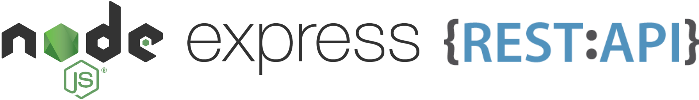
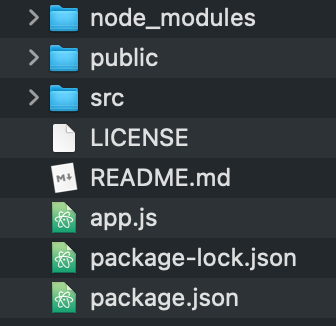
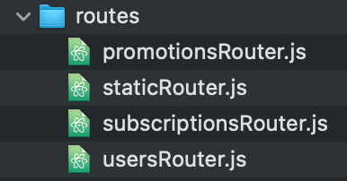
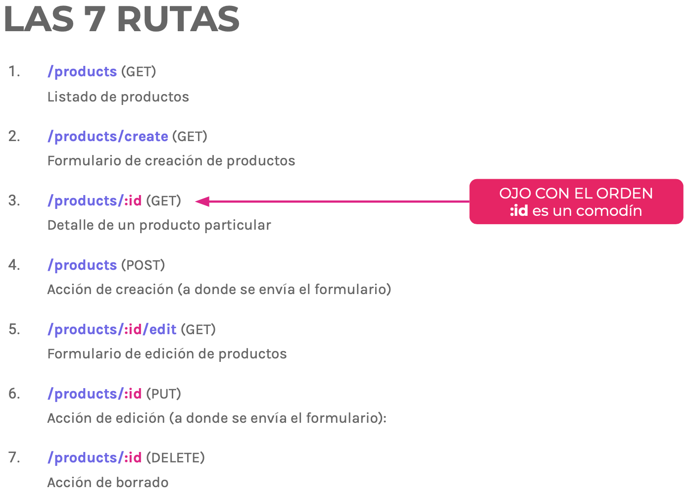
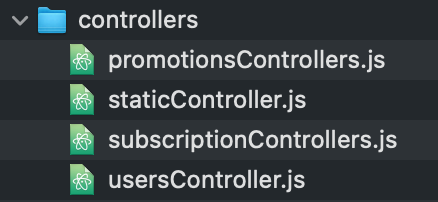
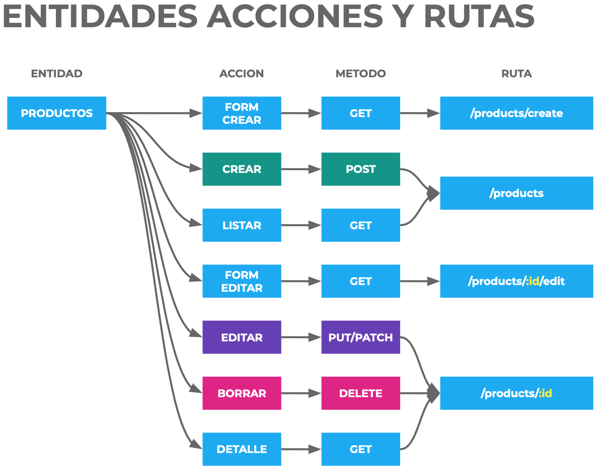

# Workflow to create backend with NodeJS

.

##### Install NodeJS and ExpressJS

```shell
$ brew install node # Only the 1st use. 
$ npm init -y # create package.json quick
```

```shell
$ npm i express
```

##### Create Folder structure.

> Create too the <u>README.md</u>, <u>LICENCE</u> & <u>.gitignore</u>.

.

##### Set Express.

In main file. e.g.: <u>app.js</u>

```js
const express = require('express');
const app = express();

app.get('/', (request, response) => {
  response.send('Hi!')
})

// Server listen and running
app.listen(3000, () => console.log('Server ready'))
```

```shell
$ nodemon app.js
```

##### Definition of MVC entities.

>  In this example, 3 entities will be used.

- Subscriptions.
- Promotions.
- Users.

##### MVC: Create Routes.

> Express documentation: https://expressjs.com/es/guide/routing.html

In main file. e.g.: <u>app.js</u>

```js
app.get('/', function (request, response) {
  response.send('The Server page works ok');
});

app.get('/subscriptions', function (request, response) {
  response.send('The Subscriptions page works ok');
});

app.get('/promotions', function (request, response) {
  response.send('The Promotions page works ok');
});

app.get('/users', function (request, response) {
  response.send('The Users page works ok');
});

// 404 Not Found
app.get('*', function (request, response) {
  response.send('404 - Not found');
});
```

<u>Test some routes:</u>

· http://localhost:5000/
· http://localhost:5000/subscriptions
· http://localhost:5000/users
· http://localhost:5000/sdfg

##### MVC: Modularize and create routes files (entities).

> A ROUTER is an "entity". BREAD: Browse, Read, Edit, Add, Delete.
> If preparing the backend to consume as API with the frontend, static is not defined as entity.

.

In main file. e.g.: <u>app.js</u>

```js
// // Static routes that do not depend on any entity (About Us, Contact, FAQ)
const staticRouter = require('./src/routes/staticRouter'); 
app.use('/', staticRouter);

// Define the http://localhost:3000/subscriptions path based on the subscriptionsRouter prefix. 
const subscriptionsRouter = require('./src/routes/subscriptionsRouter');
app.use('/subscriptions', subscriptionsRouter);

const promotionsRouter = require('./routes/promotionsRouter');
app.use('/promotions', promotionsRouter);

const usersRouter = require('./src/routes/usersRouter');
app.use('/users', usersRouter);

// 404 Not Found
app.get('*', function (request, response) {
  response.send('404 - Not found');
});
```

In the router file. e.g.:<u>subscriptionsRouter.js</u>

> Idem in the other routers entities. e.i.: <u>staticRouter.js</u>, <u>promotionsRouter.js</u>, <u>usersRouter.js</u>.

```js
const express = require('express');
const router = express.Router();

// Routing to http://localhost:5000/subscriptions
router.get('/', function (request, response) {
  response.send('The Subscriptions page works ok');
});

module.exports = router;
```

##### MVC: BREAD entities.

> 7 paths if views are rendered. 5 routes if we prepare the backend to consume it via API:
> 1 BROWSE - See all
> 3 EDIT - Edit one (edit form) (only for views)
> 4 EDIT - Edit one
> 5 ADD - Add one (creation form) (only for views)
> 6 ADD - Add one
> 7 DELETE - Delete one
> 2 READ - See one
>
> 

In the router file. e.g.:<u>subscriptionsRouter.js</u>

> Idem in the other routers entities. e.i.: <u>staticRouter.js</u>, <u>promotionsRouter.js</u>, <u>usersRouter.js</u>.

```js
router.get('/', function (request, response) {
  response.send('The Subscriptions See All page works ok');
});

/* Only if the controller will render the views. (No API)
router.get('/:id/edit', function (request, response) {
  response.send('The Subscriptions Edit Form page works ok');
}); */

router.put('/:id', function (request, response) {
  response.send('The Subscriptions Edit One page works ok');
});

/* Only if the controller will render the views. (No API)
router.get('/create', function (request, response) {
  response.send('The Subscriptions Create Form page works ok');
}); */

router.post('/', function (request, response) {
  response.send('The Subscriptions Add page works ok');
});

router.delete('/', function (request, response) {
  response.send('The Subscriptions Delete page works ok');
});

router.get('/:id', function (request, response) {
  response.send('The Subscriptions See page works ok');
});
```

##### MVC: Create controllers files.



##### MVC: Tell routes the controller method.

> 

In the router file. e.g.:<u>subscriptionsRouter.js</u>

> Idem in the other routers entities. e.i.: <u>staticRouter.js</u>, <u>promotionsRouter.js</u>, <u>usersRouter.js</u>.

```js
// Require the controller
const controller = require('../controllers/subscriptionsControllers');

router.get('/', controller.browse);
/* Only if the controller will render the views. (No API)
router.get('/', controller.browse); */
router.put('/:id', controller.edit);
/* Only if the controller will render the views. (No API)
router.put('/:id', controller.update); */
router.post('/', controller.add);
router.delete('/:id', controller.delete);
router.get('/:id', controller.read);
```

##### MVC: Create the controller standard methods.

In the router file. e.g.:<u>subscriptionsControllers.js</u>

> Idem in the other routers entities. e.i.: <u>staticRouter.js</u>, <u>promotionsRouter.js</u>, <u>usersRouter.js</u>,

```js
module.exports = {
  browse: (request, response) => {
    return response.send('The Subscriptions See All page works ok');
  },

  /* Only if the controller will render the views. (No API)
  edit: (request, response) => {
    return response.send('The Subscriptions Edit Form page works ok');
  }, */

  update: (request, response) => {
    return response.send('The Subscriptions Edit One page works ok');
  },

  /* Only if the controller will render the views. (No API)
  add: (request, response) => {
    return response.send('The Subscriptions Create Form page works ok');
  }, */

  create: (request, response) => {
    return response.send('The Subscriptions Add page works ok');
  },

  delete: (request, response) => {
    return response.send('The Subscriptions Delete page works ok');
  },

  read: (request, response) => {
    return response.send('The Subscriptions See page works ok');
  },
};
```

##### In this part of the process the control methods should show the results. The database is in charge of displaying the results.

- [Edit the methods of the controller from the database.md](./Edit the methods of the controller from the database.md).

- [Edit the methods of the controller using JSON files.md](./Edit the methods of the controller usin JSON files.md).

> Another option is to send the views directly instead of the API, in this case with EJS as template engine.

- [MVC: Tell the controller to show the views](./MVC Tell the controller to show the views.md).

##### Install thrid-party dependencies.

.

- [dotenv.md](./dotenv.md). 

  > Configuration in the environment separate from code.

- [passport.md](./passport.md).

  > If you need to manage the sessions, e.g. Superadmin.

- [express-session.md](./express-session).

  > Create a session middleware.

- [cookie-parser.md](./cookie-parser.md)

  > Parse Cookie header.


## Rest API: Create a Json file in src for each entity with its data.

##### Rest API: Set the Json Objet.

In main file. e.g.: <u>app.js</u>

```js
app.use(expess.json());
```

##### Rest API: Set how Express handles information in forms.

In main file. e.g.: <u>app.js</u>

```js
app.use(express.urlencoded({ extended: false }));
```


Json Models lo utilizo porque como uso Json, saco los métodos más comunes afuera
json Models I use it because as I use Json, I pull the most common methods outside

las rutas o controladores o sus métodos (no sé) ahora envian respuestas Json por que son APIs
routes or controllers or their methods (I don't know) now send Json responses because they are APIs

<<<<<<< HEAD
https://www.npmjs.com/package/cors

Extraigo las variables de desarrollo en archivos de producción .env y hago la documentación .env.example

requiero lainstalo la librería
https://www.npmjs.com/package/dotenv

utilizo process.env para extraer las vaiables
las pongo utilizo en app.js y ahora van a ser dínámicas

---

librería para el logueo social.
http://www.passportjs.org/

---

Si hago pública la API.
ver el tema de los token en la API (ver ejemplo en promotionsController)
(el método serch se define desde el controlador, añadirlo en el lugar que va en el readme.md)
Tengo que ver cuantas request pueden hacer por usuario.

> Documentación https://medium.com/zero-equals-false/using-cors-in-express-cac7e29b005b e31ab6eab708556c3c99110afdac185d0a669e12

